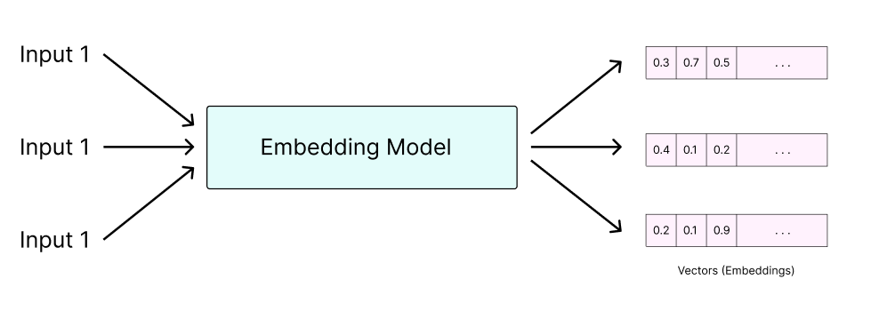

## Embeddings and Vectorization

A vector database is a database that associates a vector (a list of floating point numbers) with each data point.

Each vector is meant to be a “numerical representation” of its corresponding data point. The idea behind such a system is that similar data points will have similar vectors. We can then use mathematical formulas (such as the dot product) to efficiently compute similarities between the data points in our database.

Okay, but how do we actually convert a data point, such as a string, to a vector? We are able to do so using embeddings.

Embedding Models
Embedding models are machine learning models that are used for mapping high-dimensional data like words, sentences, audio, or images to a low-dimensional numerical representation, such as a list of numbers (a.k.a vector embeddings). They can be built and trained with techniques like neural networks.

image of different types of vector embeddings

They aim to capture similarities between data points by breaking down data into features and assigning a score for each feature in the list of numbers (vector) generated for a given data point.

Vector databases are like smart organizers for information. They are important because they help us find things quickly and accurately.

Imagine you have a big collection of pictures, and you want to find all the pictures of dogs. Instead of going through each picture one by one, a vector database can analyze the unique features of the images, like the shape of the ears or the color of the fur. This is possible through what we call “Embedding Models“, which are a way to measure those features.

It then creates special codes called vectors that represent those features. So when you search for “dog,” the database compares your search with all the vectors it has and finds the pictures that are most like dogs.

As another example, vector databases can be used to analyze the characteristics of a song and generate suggestions for similar songs.

So, vector databases help us organize and discover things in a clever and efficient way, whether it’s finding pictures or suggesting cool songs.

image of how embedding models work

There are many companies such as OpenAI or Cohere that offer their embedding models through an API (commonly known as an inference API). Luckily, however, there are also plenty of powerful open-source alternatives that we can use!

This prompts a brief introduction to Hugging Face. Hugging Face is an online hub for machine learning models, datasets, and more. In this lab, we’ll be using sentence-transformers/all-MiniLM-L6-v2 via the Hugging Face Inference API.

As the name indicates, this is a model for creating vector embeddings from textual sentences. The same concept of vectorization is also applied to other types of data such as audio or images. Naturally, however, vectorizing such data types must also be done with an appropriate model. In other words, a sentence embedding model will likely not work well on